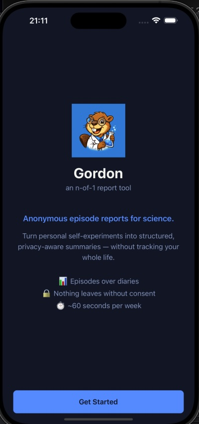
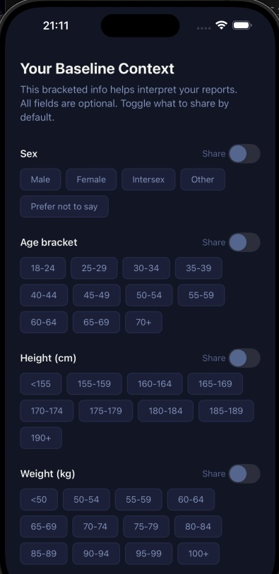
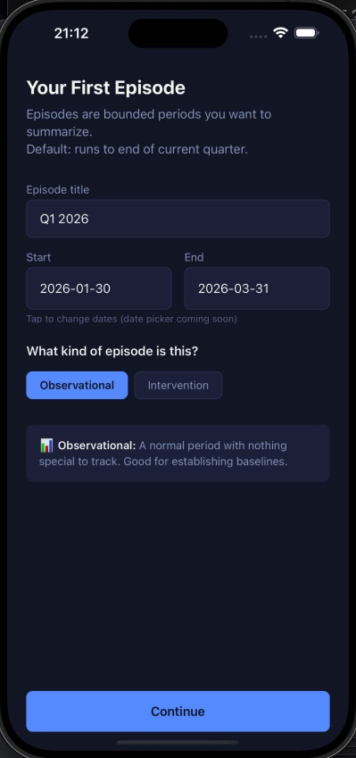
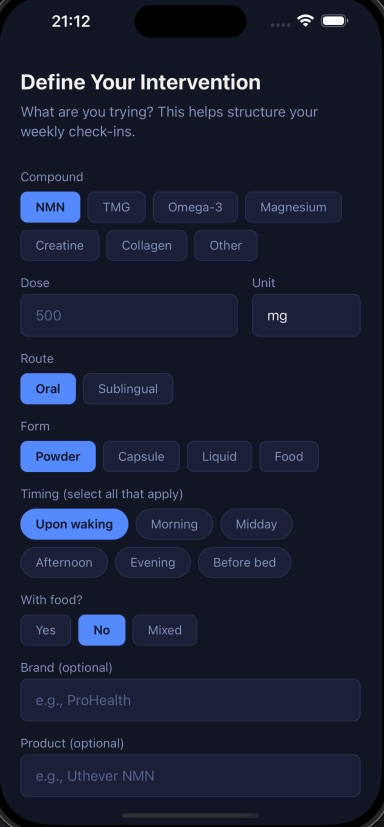
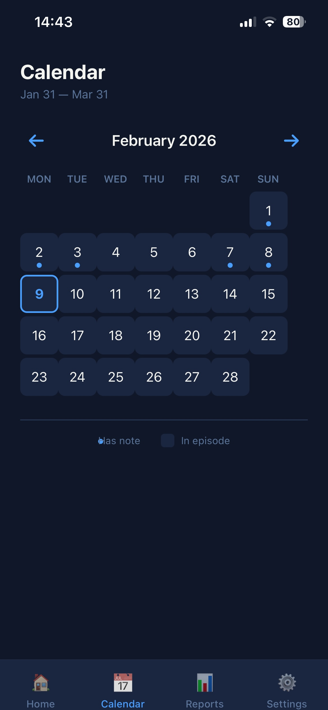
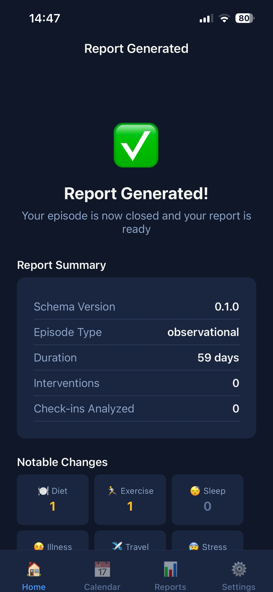
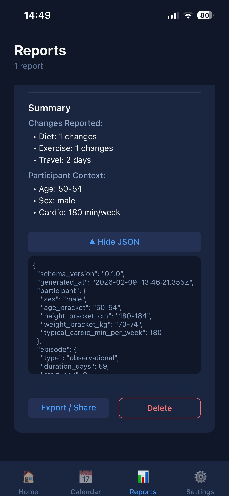

Gordon: an n-of-1 report tool

**Gordon** is a privacy-first tool for turning personal self-experiments into structured, anonymized n-of-1 reports suitable for scientific analysis.

I built this app using a method I call "Guided Iteration". The story:
    - Dr. G.I. suggested the project to me (I told him I had extra cycles)
    - fleshed out the idea with Chat GPT 5.2
    - exported a `full_spec-v01.md` file and wrote a user `interaction_story.md`
    - instructed Claude Opus 4.5 to assess the full_spec file and rough out some sensible iterations
    - Claude executed each iteration 
    - I checked and corrected each iteration where needed

I've included my notes for myself and Claude Opus 4.5 in the folder `iterations-specs/`

This Demonstrates:
    - React Native / Expo Development
    - SQLite local-first architecture
    - Privacy-by-design thinking
    - Structured AI-assisted development workflow

Tech Stack:
    - React Native
    - TypeScript
    - Expo SDK 54
    - expo-sqlite

The sourcecode is licenced under MIT.
Artwork and branding are not included in the MIT license.

## Screenshots

  
  
  
  
  
  
  

Last update: 30-Jan-2026
Last android build:
https://expo.dev/accounts/vonmoerfi/projects/gordon_n-of-1/builds/9a5ed5fa-0bab-4895-9b2a-8e526f116d77

Last ios build (requires ios device to be in dev mode):
https://expo.dev/accounts/vonmoerfi/projects/gordon_n-of-1/builds/ac7f9039-ee81-4ea8-b5a4-958a41a0d177

Feedback is welcome! Preferably via LinkedIn (link in my git profile)
